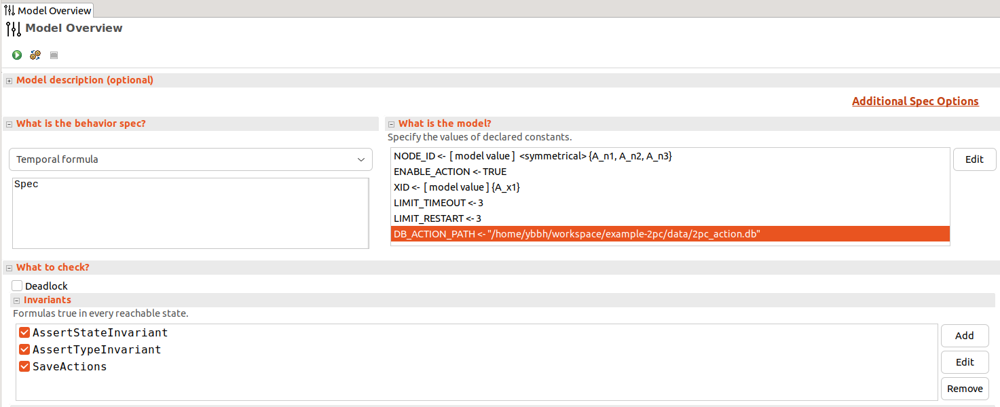
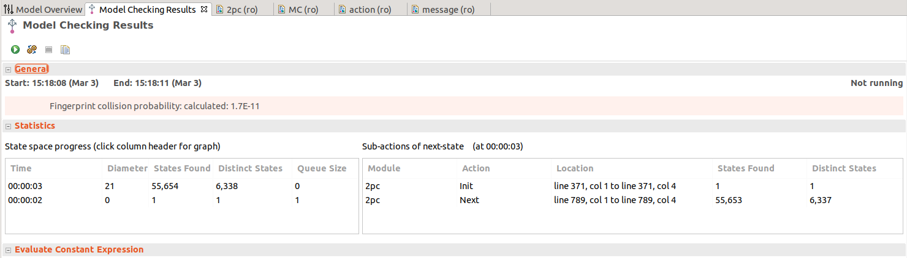

# example-2pc


This repo is an example of using [sedeve-kit](https://github.com/scuptio/sedeve-kit) to develop a two-phase commit(2PC) protocol.

## Configure The Toolbox


## Model checking and generating action database

### Open Spec

File -> Add New Spec -> Browse

Use TLA+ toolbox open specification [2pc.tla](tlaplus/spec/2pc.tla)


### Filling the model checking parameter

models -> New Models -> Model Overview

See [overview](tlaplus/doc/spec_2pc.md)



### Run TLC on the model

In path */home/ybbh/workspace/example-2pc/data/2pc_action.db*,
we find the output action database.
The action database stores all the state space the model checker explored.




## Generate trace file from action database

Use the *trace_gen* command line tool of our
[sedeve-kit](https://github.com/scuptio/sedeve-kit)
to generate a trace database.

To build *trace_gen*:
``` shell
    git clone https://github.com/scuptio/sedeve-kit
    cd sed sedeve-kit
    cargo build
```
To avoid the full path, one can add *trace_gen* to the PATH variable.

The following command generates a trace database for the action database we previously developed.
(The constant value in [mapping file](tlaplus/const_map/2pc_map_const.json) must be consistent with the constant value we
specify in model checking [spec_2pc](tlaplus/doc/spec_2pc.md))
```
trace_gen  
    --state-db-path /home/ybbh/workspace/example-2pc/data/2pc_action.db
    --out-db-path /home/ybbh/workspace/example-2pc/data/2pc_trace.db 
    --intermediate-db-path /home/ybbh/workspace/example-2pc/data/2pc_trace.intermediate.db 
    --map-const-path  /home/ybbh/workspace/example-2pc/tlapls/const_map/2pc_map_const.json
```
The **trace_gen** command then outputs the trace database *2pc_trace.db*
The generate intermediate database *2pc_trace.intermediate.db* is only used for failure recovery.

## Run deterministic simulating test

The test case would read the test case from *2pc_trace.db*(the repo split it for 4 parts) and report failure case if it has
any.

```
cargo test --package example-2pc --lib test_2pc_dtm_db

```
